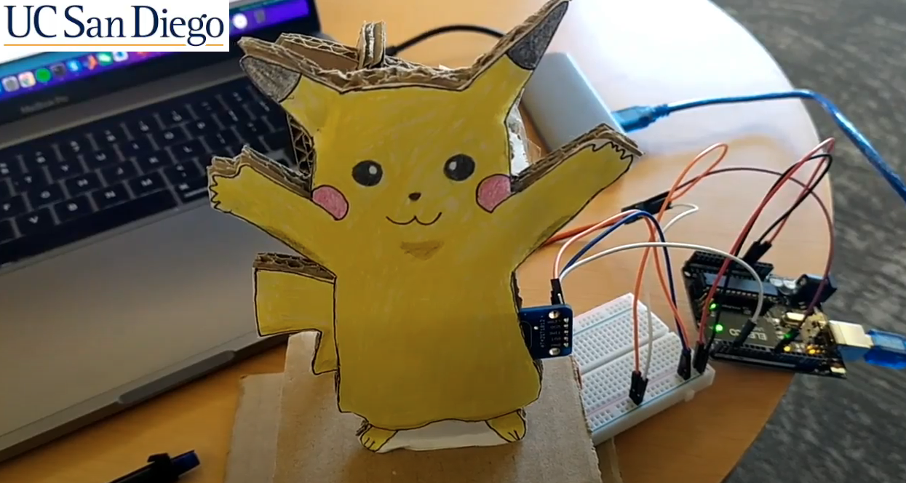

# PikaBot
A Cute and Friendly Personal Companion Robot Prototype
------------------------------------------------------
PikaBot is a social companion robot prototype that is built for both the elderly and children. We anticipated that the elderly might use it as a jukebox, and the children might use it as a playmate that play toys with them. Children and the elderly can also interact with the PikaBot by touching it near the belly.

